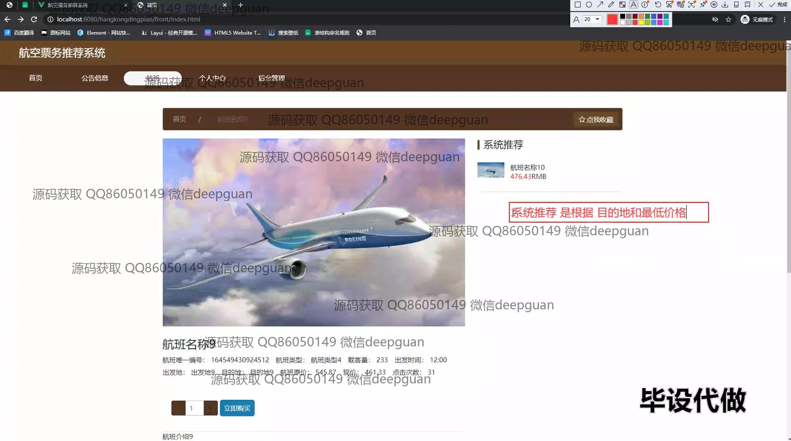
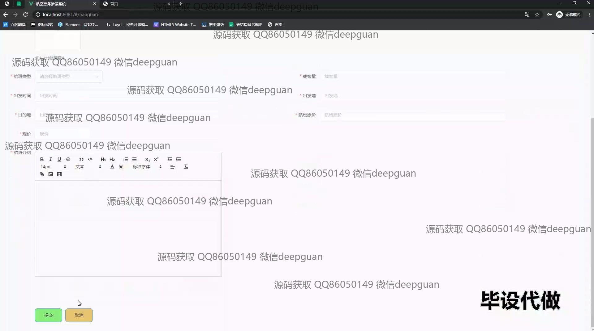

<h1 align="center">航空票务推荐系统的设计与实现+vue</h1>

## 简介
航空票务推荐系统：角色分为管理员和用户；主要功能包括用户注册与登录、航班信息管理、订单管理、留言回复、会员等级管理、系统推荐及公告管理。系统采用SSM框架和Vue技术实现。    --计算机毕业设计源码；毕设源码；java毕业设计源码

## 联系方式

<h3 align="center">获取完整代码与数据库文件 + 微信：deepguan QQ: 86050149 QQ群: 783742310</h3>

<h3 align="center">可帮忙远程部署 包运行成功！提供远程部署、修改代码、设计文档指导、代码讲解等服务！</h3>

## 功能介绍（完整见运行截图）
管理员：提供网站首页管理、公告管理、航班和订单管理功能，包括用户权限配置、公告类型发布与修改、航班信息录入与查询、订单状态管理，以及与用户的留言交流系统。同时可管理会员等级与优惠。用户：注册及维护个人账户信息，包括更新个人资料、查看及管理航班订单、收藏感兴趣航班。首页提供航班推荐和快速购票入口，支持查看航班详情、实时价格及购买收藏操作。导航栏便于访问个人中心、公告与后台。

## 运行截图

本代码来源于网络,仅供学习参考使用!

